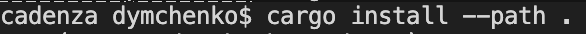
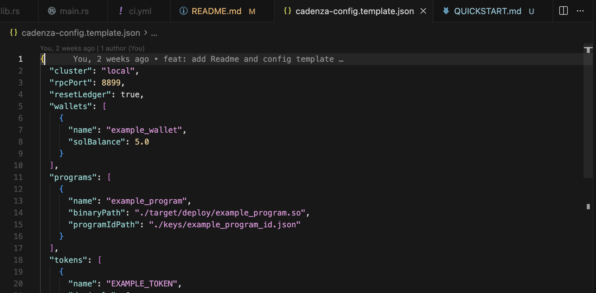
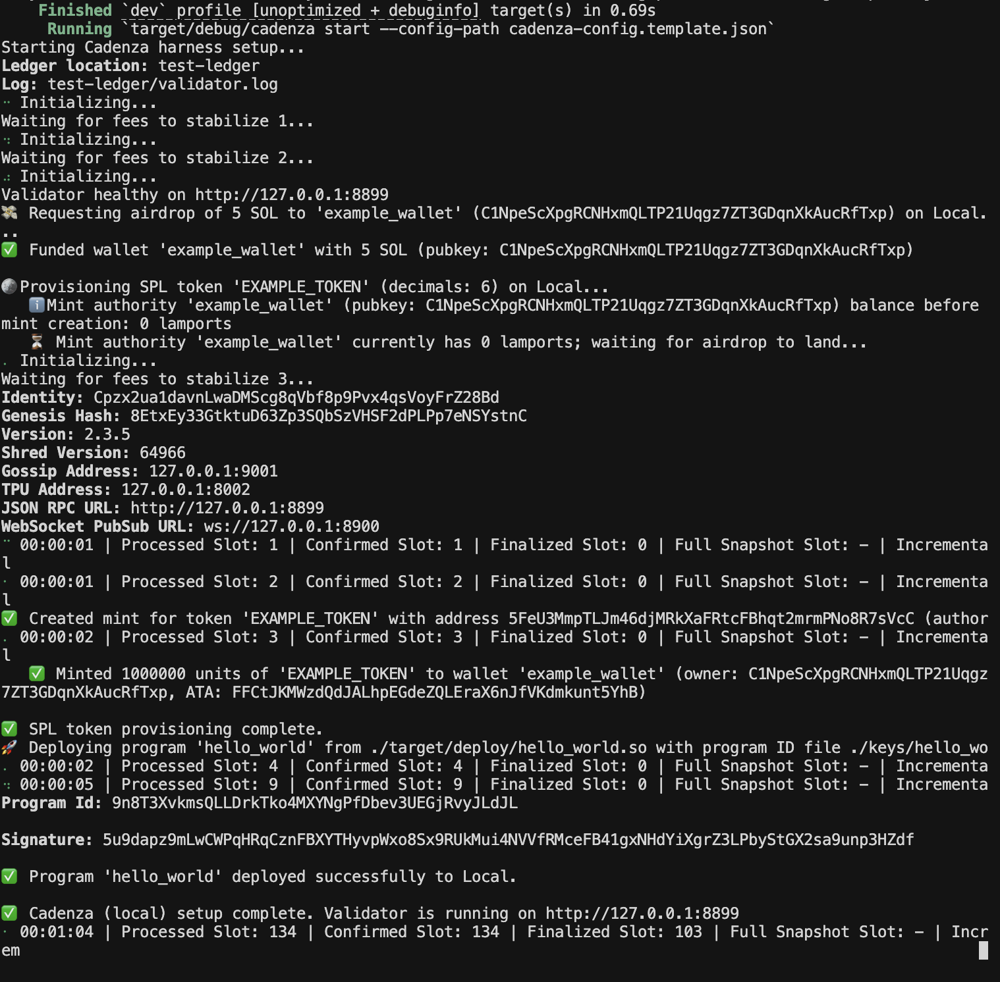
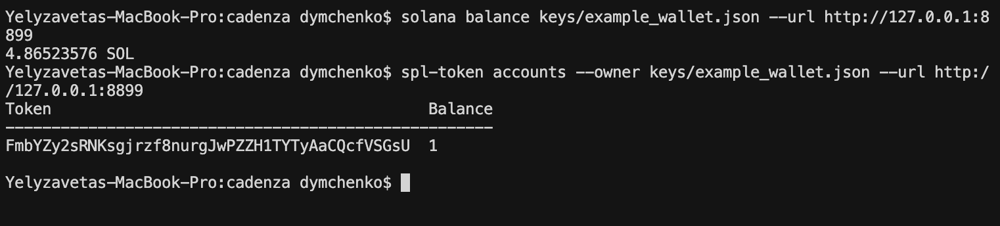
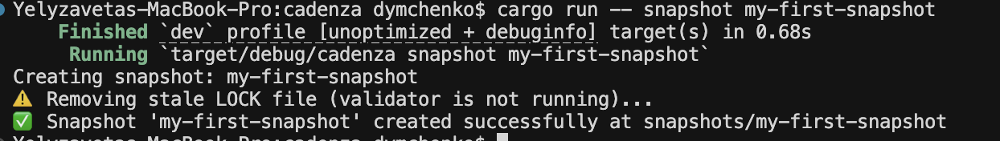
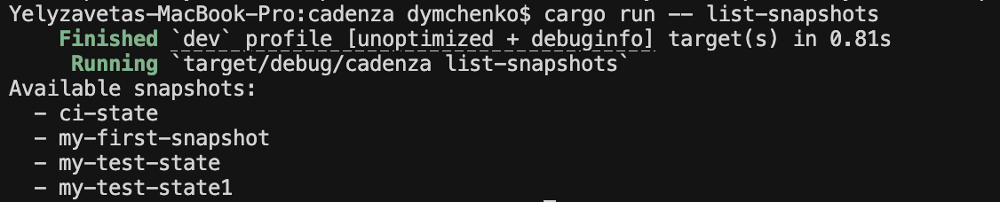
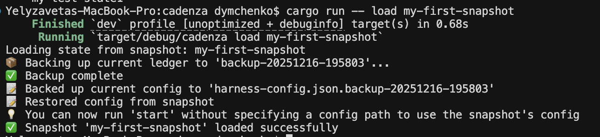
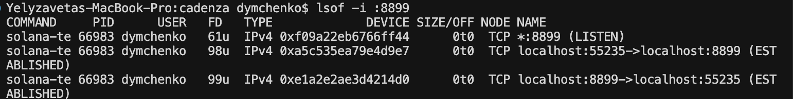

# Quick Start Guide

Get Cadenza up and running in under 5 minutes! This guide will walk you through installing Cadenza and setting up your first Solana development environment.

## 📋 Prerequisites

Before you begin, make sure you have:

- **Rust** installed ([install Rust](https://www.rust-lang.org/tools/install))
- **Solana CLI** installed ([install Solana](https://docs.solana.com/cli/install-solana-cli-tools))
- **Cargo** available in your PATH

---

## 🚀 Installation

### Option 1: Build from Source (Recommended for Development)

```bash
# Clone the repository
git clone https://github.com/dymchenkko/cadenza.git
cd cadenza

# Build the project
cargo build --release

# Optional: Install globally
cargo install --path .
```



> 📸 **Screenshot 2**: Terminal showing the build process with cargo, ending with "Finished release [optimized] target(s)"

### Option 2: Install via Cargo (When Published)

```bash
cargo install cadenza
```

---

## ⚡ Your First Cadenza Environment

### Step 1: Create Your Configuration File

Copy the template configuration:

```bash
cp cadenza-config.template.json cadenza-config.json
```



> 📸 **Screenshot 3**: File explorer or terminal showing the config file being copied

### Step 2: Customize Your Config (Optional)

Open `cadenza-config.json` and customize it for your needs. For this quick start, we'll use the default template which includes:

- One wallet (`example_wallet`) with 5 SOL
- One example program
- One example token


### Step 3: Start Your Local Validator

Run Cadenza to start your local Solana environment:

```bash
cargo run -- start
```

**What happens:**
1. ✅ Cadenza starts `solana-test-validator` on port 8899
2. ✅ Creates and funds the `example_wallet` with 5 SOL
3. ✅ Deploys your example program (if binary exists)
4. ✅ Mints and distributes the example token



> 📸 **Screenshot 5**: Terminal showing Cadenza starting up with progress messages:
> ```
> Starting Cadenza harness setup...
> 🚀 Starting local validator on port 8899...
> ⏳ Waiting for validator to become healthy...
> 💰 Creating wallet: example_wallet
> 📦 Deploying program: example_program
> 🪙 Minting token: EXAMPLE_TOKEN
> ✅ Cadenza (local) setup complete. Validator is running on http://127.0.0.1:8899
> Press Ctrl+C to stop the validator...
> ```

### Step 4: Verify Everything Works

In a new terminal, verify your setup:

```bash
# Check wallet balance
solana balance keys/example_wallet.json --url http://127.0.0.1:8899

# List token accounts
spl-token accounts --owner keys/example_wallet.json --url http://127.0.0.1:8899
```



> 📸 **Screenshot 6**: Terminal showing:
> ```
> $ solana balance keys/example_wallet.json --url http://127.0.0.1:8899
> 5000000000 SOL
> 
> $ spl-token accounts --owner keys/example_wallet.json --url http://127.0.0.1:8899
> Token                                         Balance
> ------------------------------------------------------------
> EXAMPLE_TOKEN                                1
> ```

---

## 📸 Working with Snapshots

One of Cadenza's most powerful features is the ability to save and restore your entire development environment state.

### Create a Snapshot

1. **Stop the validator** (press Ctrl+C in the terminal where Cadenza is running)

2. **Create a snapshot:**

```bash
cargo run -- snapshot my-first-snapshot
```



> 📸 **Screenshot 7**: Terminal showing:
> ```
> Creating snapshot: my-first-snapshot
> 📸 Snapshot created successfully!
>   Location: snapshots/my-first-snapshot/
>   Includes: test-ledger, cadenza-config.json
> ```

### List Snapshots

```bash
cargo run -- list-snapshots
```



> 📸 **Screenshot 8**: Terminal showing:
> ```
> Available snapshots:
>   - my-first-snapshot
>   - ci-state
> ```

### Restore a Snapshot

```bash
cargo run -- load my-first-snapshot
```



> 📸 **Screenshot 9**: Terminal showing:
> ```
> Loading state from snapshot: my-first-snapshot
> 💾 Backing up current state...
> ✅ Snapshot loaded successfully!
> ```

---

## 🎯 Common Use Cases

### Use Case 1: Quick Environment Reset

```bash
# Stop validator (Ctrl+C)
cargo run -- snapshot before-testing
# ... make changes, test things ...
cargo run -- load before-testing
cargo run -- start
```

### Use Case 2: Multiple Development Scenarios

```bash
# Scenario 1: Basic testing
cargo run -- start --config-path config-basic.json
# ... work ...
cargo run -- snapshot basic-setup

# Scenario 2: Advanced testing with multiple tokens
cargo run -- start --config-path config-advanced.json
# ... work ...
cargo run -- snapshot advanced-setup
```

### Use Case 3: Devnet Provisioning

Edit `cadenza-config.json`:

```json
{
  "cluster": "devnet",
  ...
}
```

Then run:

```bash
cargo run -- start
```

---

## 🐛 Troubleshooting

### Problem: Validator won't start

**Solution:** Check if port 8899 is already in use:

```bash
lsof -i :8899
# If something is using it, kill the process or change rpcPort in config
```



> 📸 **Screenshot 13**: Terminal showing port conflict detection and resolution

### Problem: "Program binary not found"

**Solution:** Make sure your program is compiled:

```bash
cd examples/hello_world
cargo build-sbf
# Then update binaryPath in cadenza-config.json
```

### Problem: "Snapshot already exists"

**Solution:** Delete the existing snapshot or use a different name:

```bash
rm -rf snapshots/my-snapshot-name
cargo run -- snapshot my-snapshot-name
```

---

## 🎓 Next Steps

Now that you have Cadenza running:

1. **Explore the examples**: Check out `examples/hello_world/` for a complete Solana program
2. **Read the full documentation**: See [README.md](./README.md) for advanced features
3. **Customize your config**: Add more wallets, programs, and tokens to your setup
4. **Create snapshots**: Save your progress at different stages of development

---

## 📚 Additional Resources

- [Full Documentation](./README.md)
- [Configuration Reference](./README.md#configuration-file)
- [Solana Documentation](https://docs.solana.com/)
- [SPL Token Documentation](https://spl.solana.com/token)

---

## 💡 Pro Tips

1. **Use descriptive snapshot names**: `before-refactor`, `after-token-deploy`, etc.
2. **Keep configs in version control**: Your `cadenza-config.json` can be committed to git
3. **Use non-blocking mode**: Add `--no-block` flag for CI/CD pipelines
4. **Multiple configs**: Create different configs for different testing scenarios

---

**Need help?** Open an issue on GitHub or check the [troubleshooting section](#-troubleshooting) above.
