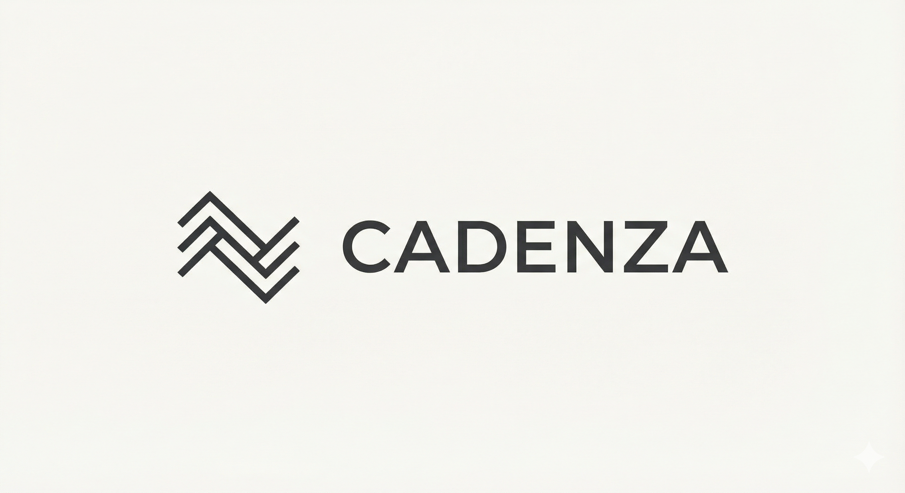
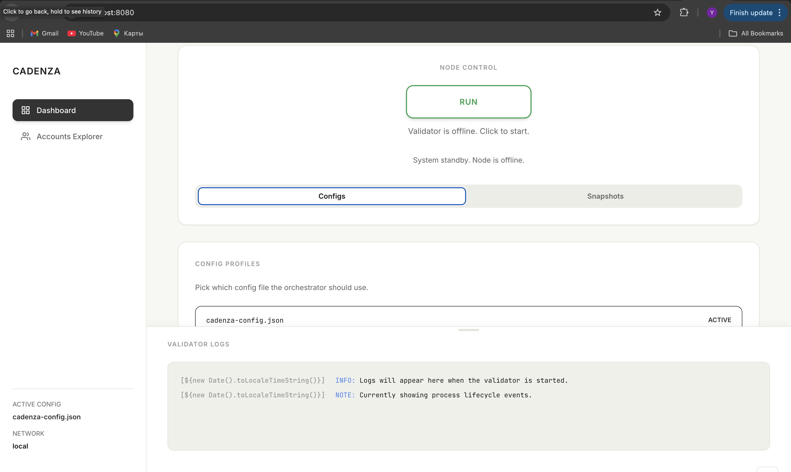

<div align="center">

## Cadenza



</div>

[](https://github.com/dymchenkko/cadenza/actions)
[](LICENSE)
[](Cargo.toml)
[](https://www.rust-lang.org/)

<h2 align="center" style="color:#7c3aed;">Stop babysitting your validator. One command. One JSON. Ship faster.</h2>

### Problem
Spinning a Solana node for every iteration is slow and noisy. You burn time re-wiring wallets, redeploying programs, minting test tokens, and copying ledgers—every single run. It’s exhausting, error-prone, and it kills momentum.

### Solution
Cadenza turns all that ceremony into a single JSON + one command. It boots your local validator (or provisions Devnet), creates wallets, deploys programs, mints tokens, and lets you checkpoint the exact state—then jump back to it instantly. Script it with the CLI or push buttons in the web UI; either way, you get a reproducible lab on demand.



### How it works (fast version)
1) **Describe** one JSON: cluster, wallets, programs, tokens, ports.  
2) **Launch** with `cargo run -- start` (or `--no-block`). Devnet? It’ll provision without a local node.  
3) **Checkpoint** with `cargo run -- snapshot <name>` and **rewind** with `cargo run -- load <name>`.  
4) **Click**: `cargo run -- web` → http://localhost:8080 to start/stop, edit configs, switch profiles, manage snapshots, and watch logs.  
5) **Swap** configs anytime from the UI or `--config-path`.

Quick start:
```bash
git clone https://github.com/dymchenkko/cadenza.git
cd cadenza
cargo build --release
cp cadenza-config.template.json cadenza-config.json

# start the harness (non-blocking so UI can run)
  cargo run -- start --no-block

# launch the web UI
cargo run -- web --port 8080
# open http://localhost:8080
```
*(Optional)* install the binary for global use: `cargo install --path .` then `cadenza start --no-block` and `cadenza web`.

### Project specification
- Core: local validator orchestration or Devnet provisioning; wallets, SPL token mint/distribution, program deploys from config; snapshots of ledger+config with backups.
- UX: CLI for scripts/CI; web UI for one-click control, config editing, profile switching, snapshots, and docked logs.
- Config shape (`cadenza-config.json`): `cluster` (`local` | `devnet`), `rpcPort`, `faucetPort`, `resetLedger`, `wallets[] { name, solBalance }`, `programs[] { name, binaryPath, programIdPath }`, `tokens[] { name, decimals, mintAuthorityWallet, recipients[] { walletName, amount } }`.
- CLI hits: `cargo run -- start --config-path my.json`, `snapshot alpha`, `load alpha`, `list-snapshots`, `web --port 3000`.
- Requirements: Rust 1.70+, Solana CLI 1.18.0+ (`solana-test-validator`, `spl-token`).
- Docs & examples: [Quick Start](./QUICKSTART.md), [Web UI Guide](./WEB_UI.md), [Examples](./examples/).

---

## 📄 License
MIT License (see [LICENSE](./LICENSE)).

